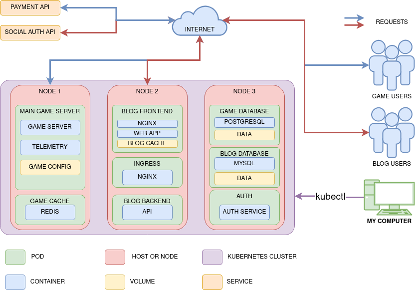

# Kubernetes Architecture Diagram

This repository contains a visual diagram of a microservices architecture deployed on a Kubernetes cluster. It represents a system composed of a game server, a blog, and multiple databases, all distributed across three nodes within the cluster.

## 📌 Contents

- **game-server**: Node dedicated to running the main game server, Redis for caching, and telemetry services.
- **blog**: Node that handles the frontend and backend of the blog, with NGINX and API services.
- **databases**: Node containing PostgreSQL, MySQL, and an authentication service.

The diagram also illustrates the flow of external user requests, exposed services, and components such as the `kubectl` client.

## 🖼️ Diagram

> You can open and edit this file using [https://app.diagrams.net/](https://app.diagrams.net/)

## ⚙️ Technologies Represented

- Kubernetes (Pods, Services, Nodes, Volumes)
- NGINX
- Redis
- PostgreSQL, MySQL
- RESTful APIs
- External Services (e.g., Payment API, Social Auth)

## 🔐 Notes

- The blog is exposed via an **Ingress Controller** (NGINX).
- Access to third-party services is made through external APIs over the internet.

Feel free to fork this repo or open an issue if you have suggestions or want to contribute improvements to the diagram.
